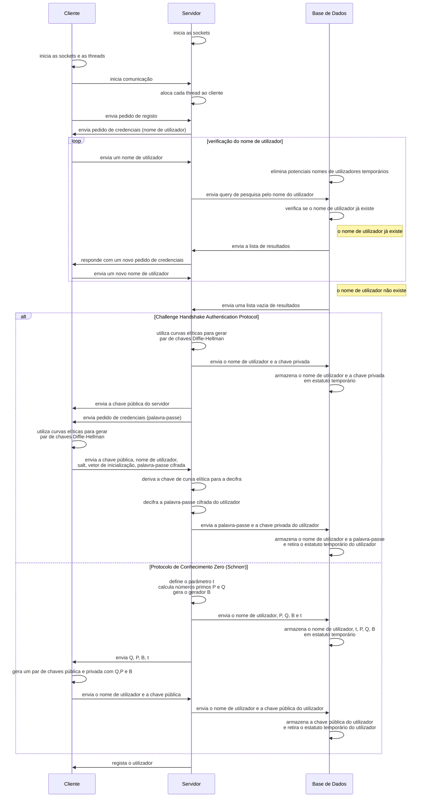
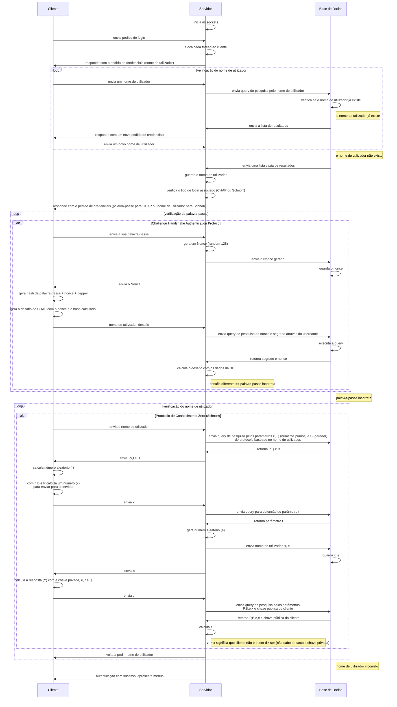

# Diagramas de Sistema

### Diagrama de Registo

- O servidor inicializa três threads: principal, chaves, mensagens. Assim será possível a cada utilizador usar o chat com vários utilizadores simultaneamente.

---

### Diagrama de _Login_

- O servidor inicializa três threads: principal, chaves, mensagens. Assim, será possível a cada utilizador usar o chat com vários utilizadores simultaneamente.
