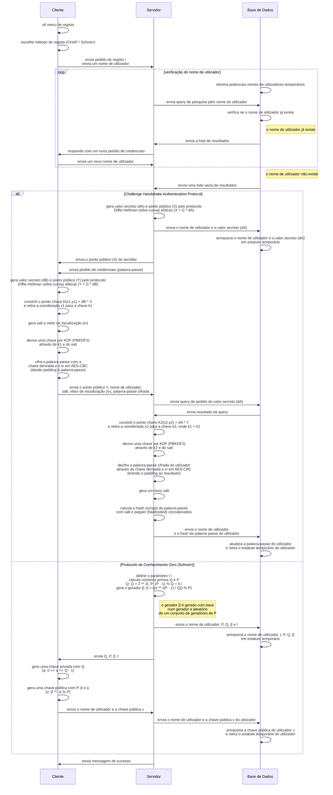
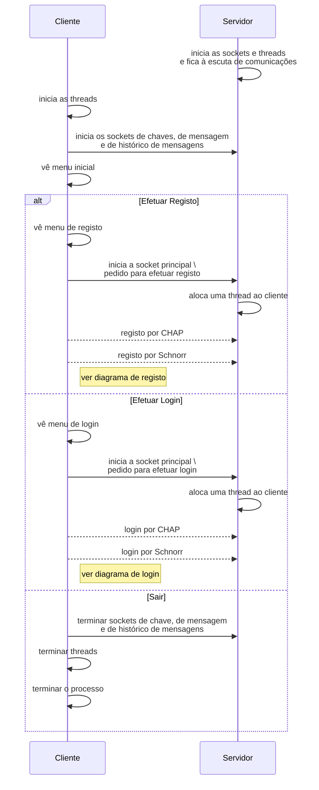

# Diagramas de Sistema

### Diagrama de Registo

- O servidor inicializa três threads: principal, chaves, mensagens. Assim será possível a cada utilizador usar o chat com vários utilizadores simultaneamente.

---

### Diagrama de _Login_

```mermaid
sequenceDiagram
    participant C as Cliente
    participant S as Servidor
    participant D as Base de Dados

    C ->> C: vê menu de login
    C ->> C: escolhe método de login (CHAP / Schnorr)
    C ->> S: incia socket principal \ <br> envia pedido de login \ <br> envia um nome de utilizador

    loop Verificação do nome de utilizador
        S ->> D: envia query de pesquisa pelo nome do utilizador
        D ->> D: verifica se o nome de utilizador já existe
        note right of D: o nome de utilizador não existe
        D ->> S: envia uma lista vazia de resultados
        S ->> C: responde com um novo pedido de credenciais
        C ->> S: envia um novo nome de utilizador
    end

    note right of D: o nome de utilizador já existe
    D ->> S: envia a lista de resultados
    S ->> S: verifica o tipo de login associado (CHAP / Schnorr)

    alt Challenge Handshake Authentication Protocol
        loop Verificação da palavra-passe
            S ->> S: gera um nonce (número aleatório de 128 bits)
            S ->> D: envia o nome de utilizador e o nonce
            D ->> D: armazena o nonce para o utilizador
            S ->> C: envia o nonce
            S ->> C: envia pedido de credenciais (palavra-passe)
            C ->> C: gera segredo s <br> s = palavra-passe + nonce + pepper
            C ->> C: gera o desafio do CHAP com o nonce e o hash calculado <br> d1 = sha512(nonce + s)
            C ->> S: envia nome de utilizador e desafio d1
            S ->> D: envia query de pesquisa do nonce e segredo através do username
            D ->> D: executa a query
            D ->> S: retorna segredo e nonce
            S ->> S: calcula o desafio d2 com os dados da BD
            note right of S: desafio diferente (d1 != d2) == palavra passe incorreta
            S ->> C: envia novo pedido de credenciais (palavra-passe)
        end
        S ->> S: guarda o nome de utilizador na lista de utilizadores online <br> guarda o nome de utilizador e socket de chaves numa lista <br> guarda o nome de utilizador e socket de mensagens numa lista

    else Protocolo de Conhecimento Zero (Schnorr)
        loop Verificação do nome de utilizador
            C ->> S: envia o nome do utilizador
            S ->> D: envia query de pesquisa pelos parâmetros <br> P, Q (números primos) e B (gerador) <br> do protocolo baseado no nome de utilizador
            D ->> D: executa a query
            D ->> S: retorna P,Q e B
            S ->> C: envia P,Q e B
            C ->> C: gera número aleatório (r: 0 ≤ r ≤ Q - 1)
            C ->> C: com r, B e P calcula um número (x = B ^ r % P) <br> para enviar para o servidor
            C ->> S: envia nome de utilizador e x
            S ->> D: envia query para obtenção do parâmetro t
            D ->> D: executa a query
            D ->> S: retorna parâmetro t
            S ->> S: gera número aleatório (e: 0 ≤ e ≤ 2 ^ t - 1)
            S ->> D: envia nome de utilizador, x, e
            D ->> D: guarda x, e para o nome de utilizador
            S ->> C: envia e
            C ->> C: recolhe a chave privada (armazenada localmente)
            C ->> C: calcula a resposta (y) com a chave privada, e, r e Q <br> y = (chave-privada * e + r) % Q
            C ->> S: envia y
            S ->> D: envia query de pesquisa pelos parâmetros <br> P,B,e,x e chave pública do cliente
            D ->> D: executa query
            D ->> S: retorna P,B,e,x e chave pública do cliente
            S ->> S: calcula z: z = (B ^ y * chave-publica ^ e) % P
            note right of S: z != x significa que cliente não é quem diz ser <br> (não sabe de facto a chave privada)
            S ->> C: envia novo pedido de credenciais (nome de utilizador)
        end
        S ->> S: guarda o nome de utilizador na lista de utilizadores online <br> guarda o nome de utilizador e socket de chaves numa lista <br> guarda o nome de utilizador e socket de mensagens numa lista
    end
    
    S ->> C: envia mensagem de sucesso
```

- O servidor inicializa três threads: principal, chaves, mensagens. Assim, será possível a cada utilizador usar o chat com vários utilizadores simultaneamente.

### Diagrama de Troca de Mensagens

```mermaid
sequenceDiagram
    participant C1 as Cliente 1
    participant S as Servidor
    participant C2 as Cliente 2
    participant D as Base de Dados

    C1 ->> S: envia pedido de amigos online
    S ->> D:  envia query de pesquisa pelos amigos do utilizador (C1)
    D ->> D:  executa a query
    D ->> S:  envia lista de amigos do cliente
    S ->> C1: envia lista de amigos online segundo a lista de clientes online
    C1 ->> S: seleciona amigo para conversar

    %% AESCipher | HMAC Keys
    note right of C1: Troca de chaves simétricas <br> Chave de cifra e chave de integridade
    C1 ->> C1: gera valor secreto (dA) e ponto público (X) pelo protocolo <br> Diffie-Hellman sobre curvas elíticas (X = G * dA)
    C1 ->> S: envia nome de utilizador (C1), nome de utilizador (C2), <br> ponto público X, tipo de chave (AES / HMAC)
    S ->> S: verifica se o segundo utilizador está online (pelo nome de utilizador (C1))
    note right of S: o segundo utilizador não está online
    S ->> C1: envia mensagem de aviso
    note right of S: o segundo utilizador está online
    S ->> C2: envia nome de utilizador (C1), <br> ponto público X, tipo de chave (AES / HMAC)
    C2 ->> C2: gera valor secreto (dB) e ponto público (Y) pelo protocolo <br> Diffie-Hellman sobre curvas elíticas (Y = G * dB)
    C2 ->> C2: constrói o ponto chave K(x1, y1) = dB * X <br> e retira a coordenada x1 para a chave k1
    C2 ->> C2: armazena localmente a chave k1
    C2 ->> S: envia nome de utilizador (C1), ponto público Y
    S ->> C1: envia ponto público Y
    C1 ->> C1: constrói o ponto chave K(x2, y2) = dA * Y <br> e retira a coordenada x2 para a chave k2
    note right of C1: k1 == k2

    %% Assinatura digital RSA
    note right of C1: Geração de chave de assinatura digital (RSA)
    C1 ->> C1: gera números primos p e q
    C1 ->> C1: calcula φN = (p - 1) * (q - 1)
    C1 ->> C1: declara e = 65537
    C1 ->> C1: calcula d = e^(-1) % φN
    C1 ->> C1: calcula N = p * q
    C1 ->> C1: armazena localmente p, q, e, d, n
    
    C1 ->> S: inicia a socket das mensagens anteriores \ <br> pede mensagens anteriores
    S ->> D: envia pesquisa por mensagens anteriores
    D ->> D: executa a query
    D ->> S: envia mensagens anteriores
    S ->> C1: mostra mensagens anteriores

    loop Troca de mensagens
        C1 ->> C1: escreve uma mensagem
        C1 ->> C1: recolhe a chave de cifra AES, a chave de integridade HMAC <br> e parâmetros RSA p, q, e, d, n, armazenados localmente
        C1 ->> C1: cria vetor de inicialização (iv), cifrando a concatenação <br> "len(ck):len(ck)+len(ik):ck||ik||p" *<br> com uma chave de cifra hardcoded
        C1 ->> C1: cifra a mensagem com a chave de cifra <br> e o vetor de inicialização (iv)
        C1 ->> C1: calcula o HMAC da mensagem cifrada
        C1 ->> C1: calcula a assinatura digital da mensagem cifrada <br> com a chave privada RSA
        C1 ->> S: envia nome de utilizador (C1), nome de utilizador (C2), <br> mensagem cifrada, vetor de inicialização (iv), HMAC, <br> n, e, assinatura digital

        S ->> S: guarda parâmetros numa queue
        S ->> S: processa a mensagem mais antiga na queue 
        S ->> S: decifra o vetor de inicialização (iv) <br> com chave hardcoded, obtendo chave de cifra, chave de integridade e p
        S ->> S: calcula q = N / p
        S ->> S: calcula d = e^(-1) % φN
        S ->> S: constrói a chave privada RSA com N, e, d, p, q
        S ->> S: decifra a mensagem cifrada com a chave de cifra <br> e o vetor de inicialização (iv)
        S ->> S: guarda texto-limpo num ficheiro <br> C1-C2-sha512(C1||C2||mensagem||data_e_tempo)
        S ->> S: espera 15 segundos
        note right of S: a mensagem pode agora ser alterada

        S ->> S: cifra a mensagem
        S ->> S: calcula HMAC da mensagem cifrada
        S ->> S: calcula a assinatura digital da mensagem cifrada
        S ->> D: envia nome de utilizador (C1), nome de <br> utilizador (C2) e mensagem não cifrada
        D ->> D: armazena a mensagem
        S ->> C2: envia nome de utilizador (C1), nome de utilizador (C2), <br> criptograma, iv, HMAC, N, e, assinatura digital

        C2 ->> C2: recolhe a chave de cifra AES, a chave de integridade HMAC <br> e parâmetros RSA p, q, e, d, n, armazenados localmente
        C2 ->> C2: constrói a chave privada RSA com N, e, d, p, q
        C2 ->> C2: decifra a mensagem com a chave de cifra <br> e o vetor de inicialização (iv)
        C2 ->> C2: calcula o HMAC do criptograma
        C2 ->> C2: calcula a assinatura digital do criptograma <br> com a chave privada RSA
        C2 ->> C2: compara o HMAC calculado com o HMAC recebido \ <br> compara a assinatura digital calculada com a assinatura digital recebida
        note left of C2: se não há correspondência entre os HMAC <br> ou entre as assinaturas digitais
        C2 ->> C2: mostra a mensagem com símbolo ✖
        note left of C2: se há correspondência entre os HMAC <br> ou entre as assinaturas digitais
        C2 ->> C2: mostra a mensagem com o símbolo ✓
    end

```

- A troca de chaves é feita a cada início de chat com outro utilizador
- \* ck = chave de cifra, ik = chave de integridade

### Outros Diagramas

#### Menu Inicial

#### Menu Principal

#### Menu de Amigos

