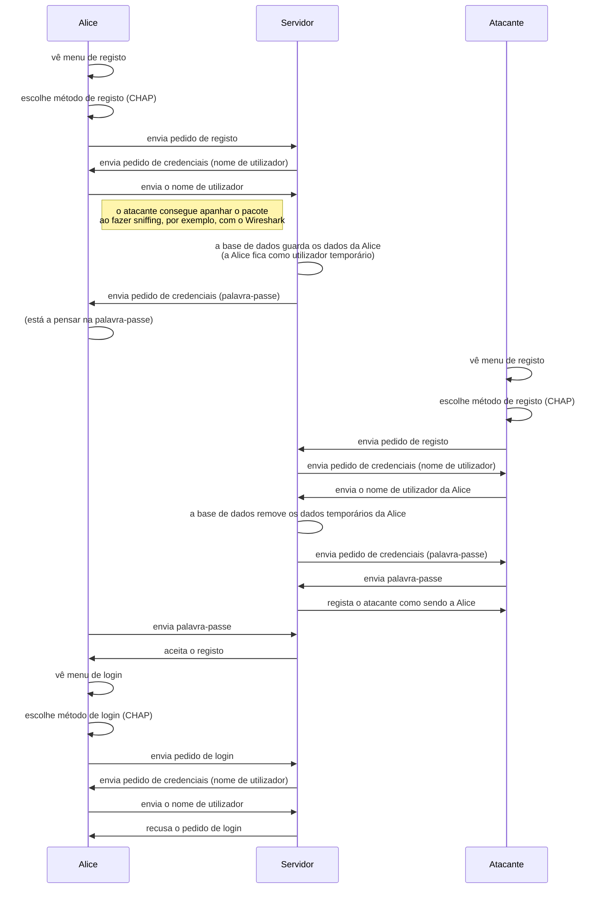

# Modelo de Ataque

Notas iniciais:
* As sockets não estão protegidas pela Secure Socket Layer, pelo que podem ser vistas por qualquer utilizador que esteja a utilizar um *sniffer* sobre a rede;
* O modelo de ataque proposto é tanto passivo como ativo:
  * Passivo - o atacante conhece o nome do utilizador;
  * Ativo - o atacante impede o registo da pessoa e faz-se passar por ela.

